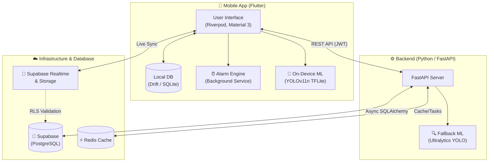

# ⏰ Wakio — Scan-to-Stop Alarm

<div align="center">
  
  
  
  
  
  
</div>

<br />

An **offline-first alarm app** designed to get you out of bed. Wakio alarms can only be dismissed by physically getting up and scanning a **random daily object** (e.g., "scan a chair" or "scan a mug") using your device's camera. 

The app features robust background execution—alarms will ring at **full volume even in silent or Do-Not-Disturb modes** and cannot simply be swiped away. It supports real-time multi-device syncing and uses on-device YOLOv11n models to run smoothly on low-end Android hardware.

---

## ✨ Key Features

- 📸 **Scan-to-Stop:** Dismiss alarms only by scanning a randomly assigned daily object with your camera.
- 🔊 **Unignorable Alarms:** Bypasses silent and Do-Not-Disturb modes, firing at full volume over the lockscreen.
- 🧠 **On-Device ML:** Uses YOLOv11n (TFLite) for fast, offline object detection (with backend fallback).
- 🔄 **Offline-First & Real-time Sync:** Works entirely offline using Drift, syncing in real-time across devices via Supabase when connected.
- 🛌 **Verified Wake System:** Checks if you're "still awake" 5–15 minutes later to prevent falling back asleep, adjusting your streak and points accordingly.

---

## 🛠️ Tech Stack

### Mobile App (Frontend)
- **Framework:** Flutter (Android)
- **State Management:** Riverpod
- **UI / Styling:** Material 3
- **Local Database:** Drift (SQLite, offline-first)
- **Routing:** go_router
- **Hardware Integration:** `alarm` engine, Camera, TFLite (On-device ML)

### Backend (API)
- **Framework:** FastAPI (Python)
- **Database ORM:** Async SQLAlchemy
- **Database & Auth:** Supabase (Postgres, Realtime, Storage)
- **Caching & Queues:** Redis
- **Machine Learning:** Ultralytics YOLOv11n (Fallback detection)

> **💡 Architecture Glue:** FastAPI signs JWTs using the **Supabase JWT secret**. This means a single access token securely authorizes both the FastAPI backend and direct Supabase Realtime/Storage connections, enforcing Row Level Security (RLS) via `auth.uid()`.

---

## 🏗️ System Architecture




---

## 🚀 Getting Started

### 1. Backend Setup

```bash
cd Backend

# Create and activate virtual environment
python -m venv .venv
# Windows: .venv\Scripts\activate
# Linux/Mac: source .venv/bin/activate

# Install dependencies
pip install -r requirements.txt

# Setup environment variables
cp .env.example .env

# Start local infrastructure (Postgres + Redis)
docker compose up -d

# Run database migrations
alembic upgrade head

# Start the FastAPI server
uvicorn app.main:app --reload --port 8011
# API Docs available at: http://localhost:8011/docs
```

*(To use managed Supabase instead of local Postgres: Set `DATABASE_URL` + `SUPABASE_*` variables in `.env`, run `alembic upgrade head`, and apply `supabase/rls_policies.sql`.)*

### 2. Mobile App Setup

```bash
cd mobile-app

# Fetch dependencies
flutter pub get

# Run Drift codegen (for the local database)
dart run build_runner build --delete-conflicting-outputs

# Run the app on emulator or physical device
flutter run -d <device-id> \
  --dart-define=API_BASE_URL=http://10.0.2.2:8011/api/v1
```
> *Note: `10.0.2.2` is the Android emulator's alias for your host machine's `localhost`.*

### 3. Object Detection Model (TFLite)

For on-device detection, the app requires a TFLite model placed in `mobile-app/assets/models/yolo11n.tflite`. 

To generate and export the model:
```bash
pip install ultralytics
yolo export model=yolo11n.pt format=tflite int8=True imgsz=320
```
Rename the output `int8 .tflite` file to `yolo11n.tflite` and drop it into the `assets/models/` directory.

> ⚠️ **Note:** Until the model is present on the device, the app will automatically fallback to the backend's `/detection/verify` endpoint (powered by server-side Ultralytics YOLO11, which is AGPL-3.0 licensed).

---

## 🧪 Testing the Alarm

> **Must use a real physical device or an Android emulator. Web is not supported for background alarms.**

1. **Create an Alarm:** Sign up and create an alarm set for 1–2 minutes from now.
2. **Lock & Silence:** Lock your phone and turn on **Silent Mode** and **Do Not Disturb**.
3. **Trigger:** The alarm will fire at full volume over the lockscreen. It **cannot be swiped away**.
4. **Scan to Dismiss:** Tap **Open Camera**. Pointing it at the wrong object will do nothing. Pointing it at the day's target object will stop the alarm and show a Scan Success screen with your points and streak.
5. **Verified Wake Check-in:** 5–15 minutes later, a gentle *"Still awake?"* alarm fires. 
   - Tap **I'm up!** within 30 seconds to mark the wake as `verified`.
   - If ignored, the loud alarm re-fires. Scanning again marks the original wake as `relapsed`, dropping it from your streak and points (visible in the **Statistics** tab).

---

## 📌 Current Implementation Status

**What's fully implemented (Vertical Slice):**
- Auth (Signup / Login / Token Refresh)
- Alarm creation
- Full-volume / DND override background ringing over the lockscreen
- Scan-to-stop mechanism (Hybrid YOLO detection)
- Gamification (Streaks & Points)
- Full offline-first capabilities with real-time backend synchronization

**Next Phase (Scaffolded but pending polish):**
- Sound Library
- Notification Center
- Alarm Edit / List refinement
- Google Sign-in integration
- FCM (Firebase Cloud Messaging) Push Notifications

---

## ⚙️ External Configuration

The following external services require configuration (placeholders are provided in the codebase):
- **Supabase Project:** URL, anon/service keys, **JWT secret**, Database connection URL
- **Google OAuth:** Client IDs
- **Firebase:** `google-services.json` (for FCM)
- **Redis:** Connection URL
